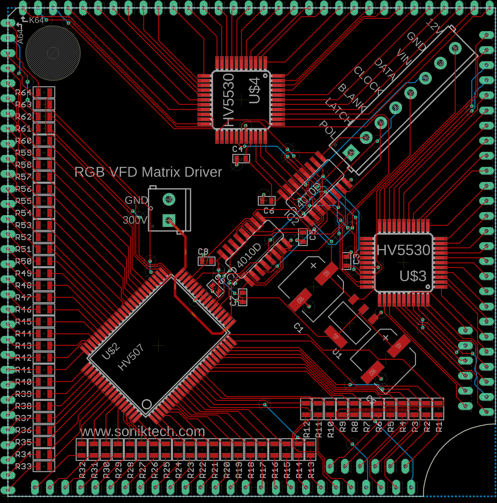

# rgb-vfd-matrix
An interface board for displaying images on a unique display

Trawling ebay one day I stumbled across the IGG4-64x64M2. It seemed like an interesting piece and a good challenge, so I designed a board to easily feed it pixel data from any microcontroller.

